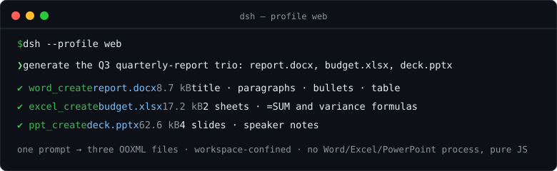

# dsh-office-tools

为 DeepSeek Harness 提供 8 个模型可调用的 Office 文件工具，全部运行在 host 半。

[](https://www.npmjs.com/package/dsh-office-tools) [](https://github.com/kw78/dsh-office-tools/actions/workflows/ci.yml) [](LICENSE) [](https://awesome-dsh-plugin.com)

> 安装：`dsh plugin --profile web add github:kw78/dsh-office-tools`

| 工具 | 作用 | 依赖 |
|---|---|---|
| `word_create` | 创建 `.docx`（标题、段落、项目符号、一个表格） | `docx` |
| `word_read` | 提取 `.docx` 文本；`format: "markdown"` 结构化渲染标题/列表/表格 | `jszip`（自研提取器） |
| `word_update` | 向现有 `.docx` 追加段落、项目符号和/或一个表格 | `docx` + `jszip` |
| `excel_create` | 创建多 sheet 的 `.xlsx`（标量单元格网格） | SheetJS (`xlsx`) |
| `excel_read` | 读取一个或全部 sheet 为标量行；公式返回缓存值或 `'=…'` 公式串 | SheetJS |
| `excel_update` | 就地替换/新建整张 sheet，或按 A1 地址写单元格 | SheetJS |
| `ppt_create` | 创建 16:9 `.pptx`（标题页、标题、段落、项目符号、备注、PNG/JPG/GIF 图片） | `pptxgenjs` |
| `ppt_read` | 按页提取段落、表格、演讲者备注、图片数量与 alt 文本 | `jszip` |

以 `=` 开头的字符串单元格会写成真正的 Excel 公式（Excel 打开时计算）。

## 演示

一句话，季度报告三件套 —— 带指标表的 Word、带 `=SUM`/差异公式的 Excel、带演讲者备注的 PowerPoint：



上图会话用的提示词：

> 生成 Q3 季度报告三件套：`report.docx`（标题、两段摘要、三个要点、一张指标表）、`budget.xlsx`（Budget sheet 含 `=SUM` 合计与计划/实际差异公式，再加一个 Summary sheet）、`deck.pptx`（标题页 + 3 页正文，含演讲者备注）。

模型会把它拆成 `word_create` → `excel_create` → `ppt_create`（回读走 `word_read` / `excel_read` / `ppt_read`；新写入的公式在被 Excel 计算缓存前以 `'=…'` 串回读）。整个流程由 `tests/demo-trio.spec.ts` 钉死，演示不会与工具行为漂移；图中的体积数字来自该测试场景的一次真实运行。

## 框架接入方式

插件遵循 DSH 标准 host 插件契约：

- 模块导出 `name` / `inject` / `apply` / `Config`；本插件 `inject = ['tools']`，唯一运行时依赖是 `ctx.tools`（`@deepseek-ai/dsh-tools`）。
- `apply(ctx)` 中用 `ctx.effect(() => ...)` 包裹 `ctx.tools.register(defineTool({...}))`，Cordis fiber 卸载时自动 dispose。
- `defineTool` 统一声明 `parameters`（模型可见 JSON Schema）、`output.schema`（强制校验的规范 JSON 值）与 `output.render`（模型看到的文本投影）。
- 每个 `execute(args, exec)` 从 `exec.agent.session.header.cwd` 取会话工作目录；相对路径按该目录解析，绝对路径只接受仍位于工作目录内的路径，并对最近存在的祖先做 `realpath` 校验防止符号链接逃逸。
- 图片文件必须位于会话工作目录内（`.png/.jpg/.jpeg/.gif`，单张上限 20 MiB）；可显式指定英寸坐标 `x/y/w/h`，省略时自动放在文本下方。
- 写文件采用同目录临时文件 + `rename` 原子落盘；`overwrite` 默认 `false`，防止误覆盖。

## 构建

```bash
pnpm install
pnpm run check   # typecheck + tests + build
```

构建产物：`lib/index.js`（ESM host bundle，仅打包本插件自有代码 + schemastery，90 kB；Office 库是常规运行时 `dependencies`，由 profile 的 node_modules 解析）与 `lib/types/**/*.d.ts`；`@deepseek-ai/*` 和 `cordis` 保持 external。

## 安装

```bash
# npm（推荐）
dsh plugin --profile web add dsh-office-tools

# GitHub 源码
dsh plugin --profile web add github:kw78/dsh-office-tools

# 本地目录
dsh plugin --profile web add /path/to/dsh-office-tools
```

安装后重启 DSH 服务。模型下一次组装提示词时即可看到 8 个工具。注意：0.6.0 起 Office 库是运行时 `dependencies`，安装时会联网拉取（npm + SheetJS 的 cdn.sheetjs.com，约 15–20 MB）；插件包本身仅 ~32 kB。

## 配置

插件通过 schemastery 声明 `Config`，由 Loader 在加载时校验。当前只有一个选项：

| 选项 | 类型 | 默认值 | 作用 |
|---|---|---|---|
| `enablePptTools` | boolean | `true` | 注册 `ppt_create` / `ppt_read`。设为 `false` 时本插件只提供 Word/Excel 工具。 |

`enablePptTools: false` 为共存而生：dsh-ppt 等专注演示文稿的插件同样会注册 `ppt_create`，而 DSH 在启动时拒绝同名工具（`tool "ppt_create" is already registered`）。关掉本插件的 PPT 工具对，把演示文稿交给专用插件：

```yaml
# profile 的 cordis.patch.yml
- insert:
    - id: dsh-office-tools
      config:
        enablePptTools: false
```

## 社区索引

- awesome-dsh-plugin / dsh-market 的登记块见 [docs/hub-registration.md](docs/hub-registration.md)。
- 仓库 topics 建议：`dsh`、`dsh-plugin`、`deepseek-harness`、`office`。

## 安全边界

- 所有读写都限制在发起调用的 agent 的会话工作目录内。
- 读取文件上限 50 MiB（压缩后体积）；解压前先校验压缩包自身声明的大小预算（单条目 ≤256 MiB、整包 ≤512 MiB、条目数 ≤100 000），zip 炸弹会被直接拒绝而不是解压；携带 DOCTYPE/ENTITY 声明的 XML 部件一律拒绝。
- 文本/单元格结果有上限并标记 `truncated`。
- 创建/更新有行数、单元格数上限，且默认不覆盖已有文件。
- 不调用 LibreOffice / PowerPoint / Word 等外部进程，所有格式均通过纯 JS 库生成/解析。
- SheetJS 固定为官方 CDN（<https://cdn.sheetjs.com>）的 0.20.3 tarball：npm 停留在 0.18.5，该版本携带 CVE-2023-30533（原型污染）与 CVE-2024-22363（ReDoS），修复版只经官方 CDN 分发。0.6.0 起它是 URL 钉死的运行时依赖——安装时从 CDN 下载且仅下载该 tarball，绝不触碰带漏洞的 npm 版本。
- 版本路线见 [docs/ROADMAP.md](docs/ROADMAP.md)。
