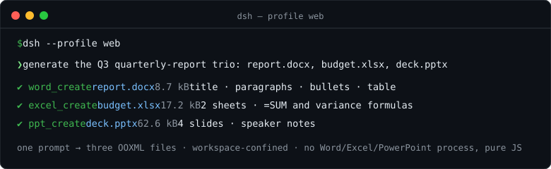

# dsh-office-tools

[](https://www.npmjs.com/package/dsh-office-tools) [](https://github.com/kw78/dsh-office-tools/actions/workflows/ci.yml) [](LICENSE) [](https://awesome-dsh-plugin.com)

> **如果你觉得本项目好用的话，请给个 ⭐ Star —— 谢谢！**

为 DeepSeek Harness 提供 8 个模型可调用的 Office 文件工具：在会话工作区内创建、读取、更新 Word（`.docx`）、Excel（`.xlsx`）、PowerPoint（`.pptx`）。零运行时依赖 —— 文件由插件自带的 OOXML 引擎生成与解析，所有字节都经官方 `ctx.fs` 服务传输。

## 工具

| 工具 | 作用 |
|---|---|
| `word_create` | 创建 `.docx`（标题、段落、项目符号、一个表格） |
| `word_read` | 提取文本；`format: "markdown"` 结构化渲染 |
| `word_update` | 向现有文档追加段落、项目符号和/或表格 |
| `excel_create` | 创建多 sheet 的 `.xlsx` |
| `excel_read` | 读取 sheet 为行；公式返回缓存值或 `'=…'` 串 |
| `excel_update` | 替换/新建整张 sheet，或按 A1 地址写单元格 |
| `ppt_create` | 创建 16:9 `.pptx`（幻灯片、要点、备注、链接式图片） |
| `ppt_read` | 提取文本、备注、表格与每个形状的几何信息 |

以 `=` 开头的字符串单元格会写成真正的 Excel 公式。

## 演示

一句话，季度报告三件套：



## 安装

```bash
dsh plugin --profile web add dsh-office-tools              # npm（推荐）
dsh plugin --profile web add github:kw78/dsh-office-tools  # 源码
```

安装后重启 DSH。宿主需提供 `fs` 服务（凡带内置 read/write 工具的 profile 都有）。

## 注意事项

- 所有路径限制在会话工作目录内；`overwrite` 默认 `false`。
- 读取接受任意真实包（STORE/DEFLATE），带 zip 炸弹防御；更新遇到含二进制部件的包会明确拒绝而非损坏它。
- PPT 图片为**链接式**（非内嵌）：官方 `ctx.fs` 写入通道只支持 UTF-8 文本，包内无法携带二进制图片部件。移动 deck 时请连同图片文件；另注意 PowerPoint 默认阻止外部内容——链接图片会显示为"已阻止自动下载此图片"占位符，需手动启用外部内容（文件 → 信息 → 启用内容，或把目录加入信任中心的可信位置）后才会显示。这是 PowerPoint 的安全策略，不是包结构缺陷。
- `ppt_create` 回显每个元素的落点坐标；`ppt_read` 对任意 deck 返回同样的几何信息。

## 配置

只有一个选项：`enablePptTools`（默认 `true`）——与 dsh-ppt 等专用演示插件共存时设为 `false`：

```yaml
- insert:
    - id: dsh-office-tools
      config:
        enablePptTools: false
```

## 开发

```bash
pnpm install && pnpm run check   # typecheck + tests + build
pnpm run test:e2e                # 真实组合 E2E（sandbox-policy + fs-sandbox + tools）
```

兼容性：DSH `>=0.1.0-rc.6`；逐版本的精确兼容记录见 `package.json`（`dsh.compatibility.dshReleases`）。

更多文档：[DEVELOPMENT.md](docs/DEVELOPMENT.md) · [ROADMAP.md](docs/ROADMAP.md) · [hub-registration.md](docs/hub-registration.md) · MIT [License](LICENSE)
