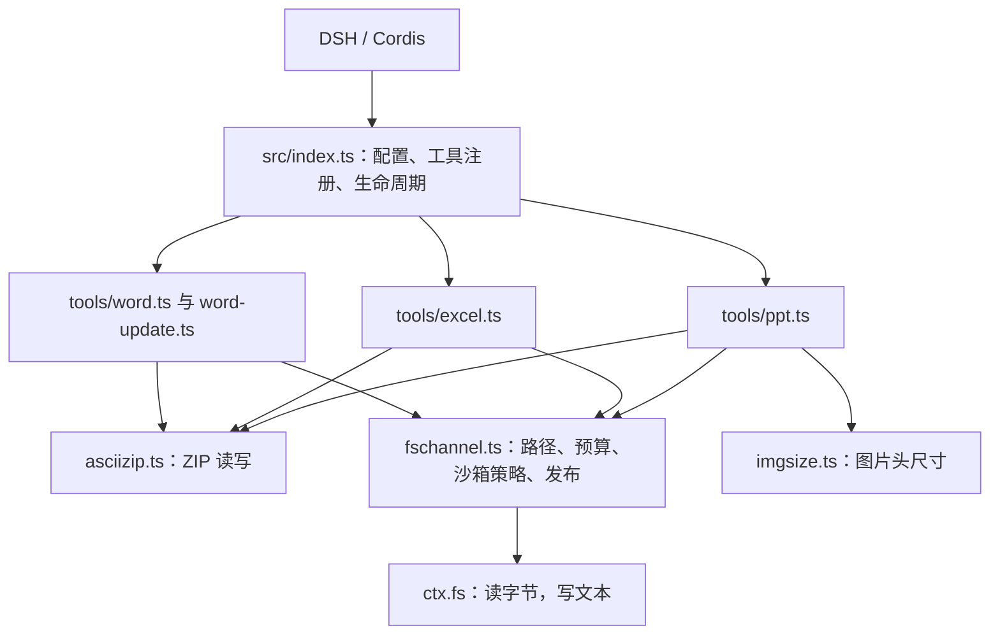
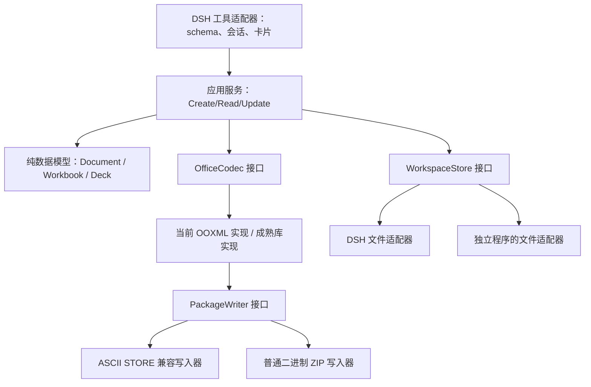

# 架构分析、可靠性修复与图片嵌入路线

分析日期：2026-10-01。基线为仓库 main 的 1.0.4 源码；修复目标版本为 1.0.5。

## 1. 结论

建议采用轻量的“端口与适配器”架构：让业务逻辑只依赖小接口，把 DSH、Office 编解码库、ZIP 容器和文件存储作为可替换实现。无需为了分层引入 NestJS、微服务或复杂依赖注入框架。它们无法解决文本通道与二进制 Office 文件之间的根本冲突。

当前最值得保留的是八个工具的调用契约、宿主文件服务和工作区边界。最值得隔离的是 ASCII ZIP 写入器：它是平台限制产生的兼容实现，不应决定未来所有格式后端的能力。

## 2. 当前调用链



- `src/index.ts`：以 Cordis effect 注册和清理八个工具；通过 `enablePptTools` 处理名称冲突。
- `src/fschannel.ts`：统一解析路径、限制工作区、取得会话策略、检查大小/覆盖、执行原子文本写入。路径与沙箱实现由宿主拥有。
- `src/asciizip.ts`：STORE/DEFLATE 读取、解压预算、DTD 拒绝；生成端采用全 ASCII 的 STORE ZIP，以便 UTF-8 文本写入不会改变字节。
- `src/tools/*.ts`：同时包含调用 schema、校验、格式生成/解析、文件访问编排和输出卡片。PPT 文件尤其集中：布局、主题、关系、备注、图片链接、读取和工具注册都在一个模块中。
- `tests/harness.ts`：工具注册和文件服务替身；`real-composition.mjs` 用真正的宿主服务验证策略传播；JSZip 是开发期独立格式校验器。

已有模块划分和统一文件通道是优点。问题不在于所有代码都没有模块，而在于模块边界仍把宿主上下文、格式生成和 UI 输出混在一起。

## 3. 为什么会反复出现问题

| 故障 | 直接原因 | 暴露的边界问题 |
|---|---|---|
| #2/#3：工作区内写入也被拒绝 | 没有传会话级沙箱策略 | 测试替身没有覆盖真实宿主服务契约 |
| #4：超过 4KB 的图片无法读取 | 把整文件大小上限当作头部读取长度 | 底层文件 API 语义直接渗入图片布局逻辑 |
| #5：真实 Office 无法打开 | ZIP 条目间隙被宽容读取器接受 | 自己写、自己读通过，不能证明真实消费者接受 |
| #6：新宿主跳过插件 | peer 范围与运行版本不匹配 | 插件启动兼容判定没有被功能测试覆盖 |
| #7：多页 PPT 打包失败 | CRC、长度、偏移联合搜索过于受限 | 所有格式能力受特殊文本通道实现制约 |

这些故障分别属于宿主、存储、容器和消费者契约。应分别设检查，不能依赖单一工具往返测试。

## 4. 本次已经完成的修复

### 打包器

1. 先计算安全的载荷长度和连续偏移；在必要时跳过不安全字节区间，不逐字节盲目搜索整个区间。
2. 使用有效 local extra field 调整偏移，长度字段本身也必须安全。
3. 最后变化固定长度的 8 个尾随空格/tab，单独调整 CRC，不再改变已确定的布局。这里的填充只适用于 XML 等允许尾部空白的文本部件，不是通用二进制打包器。
4. 对实际条目数补齐到安全数值；补齐内容是合法、不引用的 XML 部件，不伪造 EOCD 计数。避免名称碰撞；没有 `.xml` 默认类型时添加明确的 content type。
5. 保持 ZIP 条目连续，限制输出到 50 MiB，拒绝重复条目名。PPT 200 页预算包括封面。

这不是“增加重试次数”：扩大原始换行搜索范围仍无法解决已复现输入。新实现拆开了原先互相牵制的约束。

### 兼容声明与工程检查

- 对 DSH 0.2.0-rc.1 实际包运行类型检查、工具测试和真实组合 E2E。
- 五条 DSH peer 添加 0.2.x 范围，兼容记录、插件版本和 README 同步；目标版本号为 1.0.5。
- 用宿主相同的 semver `includePrerelease` 判据测试声明的精确版本，并确保 0.3.x 未被声明支持。
- CI 增加 0.1.2-rc.1 / 0.2.0-rc.1 必过矩阵；next 检查改为每日及手动触发，更新所有直接 DSH 开发依赖，不再吞掉失败。
- 显式关闭未使用的间接 koffi 安装脚本，保留 esbuild 构建。没有引入运行时依赖。

### 验证范围

- 82 个测试通过，包含独立 JSZip CRC 校验、连续性、EOCD 实际计数、大小边界、名称碰撞及 5/7/10/25/29/57/200 页带备注中文 PPT。
- DSH 0.1.2-rc.1、0.2.0-rc.1 真正文件/策略/工具服务组合验证八个工具，工作区外写入仍拒绝。
- 本机 Microsoft Office COM 实测：Word 打开普通文档和补齐条目数的文档；Excel 打开文件并将 `=A2*2` 计算为 84；PowerPoint 打开 5/29/200 页带备注文件，页数正确。
- 没有在本机运行 Linux、macOS 或 Node 20/22；这些由更新后的 CI 执行。远程 CI、推送和发布状态以关联 PR、GitHub Release 和 npm 登记为准。
- 旧 `xlsx 0.18.5` 仅用于测试夹具，仍应在单独的开发依赖清理任务中替换；本次没有把它引入运行时。

## 5. 推荐的目标架构



建议目录边界：

```text
src/
  adapters/dsh/       # 唯一了解 Cordis、ctx、ToolRunContext 的区域
  application/        # 创建、读取、更新的编排
  domain/             # 纯数据结构、内容/数量校验、布局计算
  ports/              # WorkspaceStore、OfficeCodec、PackageWriter
  codecs/word/        # Word OOXML 及读写实现
  codecs/excel/       # Excel OOXML 及读写实现
  codecs/ppt/         # PPT 主题、幻灯片、备注、关系、媒体
  packaging/          # ascii-store 与未来标准 ZIP
```

具体边界原则：

- 业务层不传递 `ctx`，不读取 `session.header.cwd`，不决定 ZIP 字段；适配器将宿主信息转换成执行能力和资源预算。
- 格式层返回内存部件或字节，不自己写文件；它不负责权限，也不调用本地路径读取图片。图片先由 `WorkspaceStore` 读取为受限字节，再交给格式层。
- 输出卡片和文字线框放在 DSH 展示层；核心生成器返回结构化布局。
- 创建和更新应有不同契约：创建允许生成新包，更新需要保留未知部件；不能只因一个库支持创建，就宣称能无损修改任意 Office 文件。
- 能力要显式声明，例如 `binaryWrite`、`embeddedMedia`、`preserveUnknownParts`。缺少能力时，返回明确原因；不要悄悄把嵌入改成链接。
- 一个入口负责组合实现。接口通过普通构造参数或工厂函数注入，暂不需要 DI 容器。

这一目标分层尚未全部迁移；本次主要改动是共享打包器和兼容性检查。分层迁移应逐个工具做，不与格式后端替换同时进行。

## 6. PPT 真实嵌入的可行性

真实嵌入通常需要：图片字节作为 `ppt/media/...` 部件；幻灯片关系指向包内媒体；`a:blip` 使用 `r:embed`；正确的 Content Type。输出必须是二进制 ZIP。

已核对 DSH 0.2.0-rc.1 的 `dsh-fs` 与 `dsh-fs-sandbox` 发布包：它们提供 `readBytes` 和 `readByteRange`，写入仍为 `writeText`/`editText`，没有公开 `writeBytes`。因此当前安全文件服务契约下，常规 PNG/JPEG 真嵌入无法靠修改一个 PPT 参数完成。把图片变成 base64 文字写入 XML，不等于 PowerPoint 的正常嵌入图片部件。

| 路线 | 可行性 | 建议 |
|---|---|---|
| 宿主增加受策略约束的二进制写入 | 最契合当前插件 | 优先：让宿主拥有路径、原子写入、版本检查和权限审计 |
| 独立 Office 引擎／程序由外部可信执行环境发布文件 | 可在不同部署形态实现 | 宿主不方便扩展时可选；需要独立部署和权限契约 |
| 插件直接使用本地 fs 绕过宿主 | 技术上能写文件，但改变安全与商店契约 | 不作为当前插件的默认实现 |

二进制后端接入后，可以先只替换 ZIP 层、保留现有 OOXML，也可以将 PPT 创建迁移到 PptxGenJS。PptxGenJS 接受图片 base64 数据；应由授权存储层读取图片、生成器返回内存字节、存储层发布文件，避免让库直接通过 `path`/`writeFile` 访问本地文件。参考 [官方图片接口](https://gitbrent.github.io/PptxGenJS/docs/api-images/)。

未来嵌入功能的验收必须包含：包内媒体字节校验、内部关系检查、真实 PowerPoint 打开，以及移走原图片后重新打开 PPT 仍能显示图片。

## 7. 迁移顺序

1. 发布并观察本次共享打包器/兼容性修复。
2. 先拆 PPT 的注册/展示与纯布局/格式生成，保持工具参数及输出不变。
3. 抽出 `WorkspaceStore` 与 `OfficeCodec`，让核心在没有 DSH 的环境中测试。
4. 建立宿主二进制写入能力；同时实现标准 ZIP 后端。
5. 增加真正的图片嵌入，再评估 PptxGenJS/ExcelJS/docx 等格式库适配器及其许可证、供给链、更新保真和包体预算。

这样每一步都能独立验证和回滚。长期目标是把平台兼容问题限制在适配器里，把 Office 格式问题限制在编解码器里。
